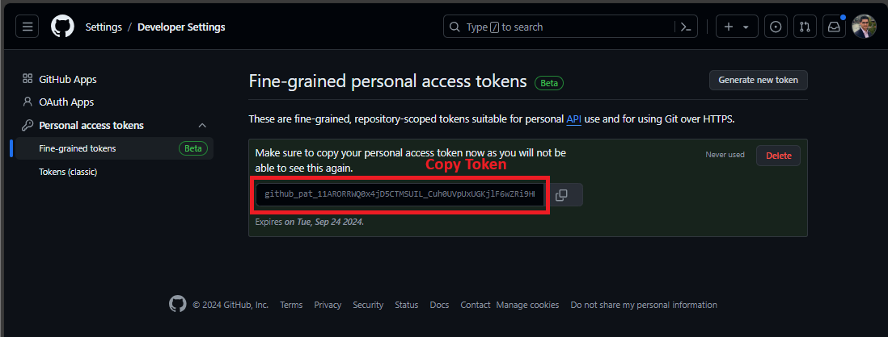

# Microsoft Fabric: OneLake Remote Operations

This project provides a comprehensive solution for managing **Tables** and **Files** from a Lakehouse in Microsoft Fabric OneLake using the [azure-identity](https://pypi.org/project/azure-identity/) and [azure-storage-file-datalake](https://pypi.org/project/azure-storage-file-datalake/) Python SDKs.

For more details, see the official [Microsoft documentation](https://learn.microsoft.com/en-us/fabric/onelake/onelake-access-python) and [GitHub: single_tech_samples/fabric/fabric_ci_cd](https://github.com/Azure-Samples/modern-data-warehouse-dataops/tree/main/single_tech_samples/fabric/fabric_ci_cd).

## Table of Contents

- [Features](#features)
- [Prerequisites](#prerequisites)
- [Installation](#installation)
- [Get Authentication Variables & Credentials](#get-authentication-variables--credentials)
  - [Azure Portal Steps](#azure-portal-steps)
  - [Fabric Portal Steps](#fabric-portal-steps)
  - [Azure DevOps Steps](#azure-devops-steps)
  - [GitHub Steps](#github-steps-required-for-private-repos-only)
- [Usage](#usage)
  - [Running `main.py`](#running-mainpy)
  - [Testing with `test.ipynb`](#testing-with-testipynb)
    - [First Steps](#first-steps)
    - [Write to Lakehouse (Files/Tables)](#write-to-lakehouse-filestables)
    - [List Items from Lakehouse (Files/Tables)](#list-items-from-lakehouse-filestables)
    - [Read Delta Table from Lakehouse](#read-delta-table-from-lakehouse)
    - [Download Items from Lakehouse (Files/Tables)](#download-items-from-lakehouse-filestables)
    - [Delete Items from Lakehouse (Files/Tables)](#delete-items-from-lakehouse-filestables)
- [Troubleshooting](#troubleshooting)
- [Contributing](#contributing)
- [Contact](#contact)

## Features

- Authentication using Azure credentials
- File and directory management in OneLake storage
- Upload, download, list, and delete operations for Files and Tables (Delta format)
- Support for local Files/Tables, GitHub repositories (public and private), and Azure DevOps repositories
- Delta table support for efficient data storage and retrieval

## Prerequisites

- Python 3.7 or later
- pip (Python package installer)
- An Azure account with access to Microsoft Fabric
- A Microsoft Fabric workspace and Lakehouse
- Git (for version control and cloning the repository)
- An IDE or text editor (e.g., Visual Studio Code, Jupyter Notebook, PyCharm)
- GitHub account (for private repository access, if applicable)
- Azure DevOps account (for Azure DevOps repository access, if applicable)

## Installation

1. Clone the repository:
   ```bash
   git clone https://github.com/renan-peres/fabric-onelake-remote-operations.git
   cd fabric-onelake-remote-operations
   ```

2. Create a virtual environment (optional but recommended):
   ```bash
   python -m venv venv
   source venv/bin/activate  # On Windows use `venv\Scripts\activate`
   ```

3. Install dependencies:
   ```bash
   pip install -r requirements.txt
   ```

4. Set up environment variables:
   ```bash
   cp .envtemplate .env
   ```
   Then edit the `.env` file with your credentials.

## Get Authentication Variables & Credentials

To interact with OneLake storage, you need to set up Azure Service Principal credentials in the `.env` file. Follow these steps to obtain the necessary values:

> **Note**: For detailed instructions on creating an app registration in the Azure Portal, refer to the [Fivetran OneLake Setup Guide](https://fivetran.com/docs/destinations/onelake/setup-guide).

### Azure Portal Steps

1. **Register a New Application** in the Azure Portal, navigate to Entra ID.
   
   

2. **Get Client & Tenant IDs** from the application's overview page.
   

3. **Create & Get Client Secret** in the Certificates & secrets section.
   

Edit the `.env` file with the obtained values from the Azure Portal:

```bash
# Azure Service principal (SP) credentials
AZURE_CLIENT_ID= "<your_azure_client_id>"
AZURE_TENANT_ID= "<your_azure_tenant_id>"
AZURE_CLIENT_SECRET= "<your_azure_client_secret>"
```

### Fabric Portal Steps

1. **Get Workspace ID, Lakehouse ID** from the Fabric Portal URL.
   

2. **Add Application Service Principal to Workspace** with at least Contributor access.
   

Edit the `.env` file with the obtained values from the Fabric Portal.

```bash
# Microsoft Fabric workspace and lakehouse details
ACCOUNT_NAME= "onelake"
WORKSPACE_ID= "<your_fabric_workspace_id>"
LAKEHOUSE_ID= "<your_fabric_lakehouse_id>"
LAKEHOUSE_NAME = "<your_fabric_lakehouse_name>"
```

### Azure DevOps Steps

1. **Create a Personal Access Token (PAT)**:
- Navigate to user settings in Azure DevOps portal.

- Click on the "+ New Token" button to create a new PAT.

- Fill in the token details and create it.

- Copy the token immediately after creation.


2. **Get Organization URL, Project Name, and Repo Name**


3. **Update the `.env` file** file with the obtained values from the Azure DevOps Portal.

   ```bash
   # Azure DevOps details and personal access token (PAT)
   PERSONAL_ACCESS_TOKEN="<paste_your_copied_PAT_here>"
   ORGANIZATIONAL_URL="https://dev.azure.com/your-organization"
   PROJECT_NAME="<your_azure_devops_project_name>"
   REPO_NAME="<your_azure_devops_repo_name>"
   ```

### GitHub Steps (Required for Private Repos Only)

Create a PAT in GitHub with appropriate permissions at [Create New Access Token](https://github.com/settings/tokens/new). **Use the tokens (classic) option**.

1. **Create a Personal Access Token (PAT)**:
- Go to GitHub account settings > Developer settings > Personal access tokens -> Gerate new roken (classic).

- Generate a new token with necessary permissions.

- Copy the generated token immediately.


2. **Get Your Username and Private Repo Name**

3. **Update the `.env` file** file with the obtained values from GitHub.

   ```bash
   # GitHub details and personal access token (PAT)
   GITHUB_PERSONAL_ACCESS_TOKEN="<paste_your_copied_PAT_here>"
   GITHUB_USERNAME="your_username"
   GITHUB_REPO_NAME="your_github_repo_name"
   ```

Remember to keep your PAT secure and never share it publicly. If you suspect your token has been compromised, revoke it immediately in the GitHub settings and create a new one.

## Usage

### Running [main.py](main.py)

The `main.py` script provides various methods to interact with OneLake storage. Here's a basic example:

```python
from main import OneLakeRemoteOperations

onelake_ops = OneLakeRemoteOperations()
token = onelake_ops.get_authentication_token()
file_system_client = onelake_ops.get_file_system_client(token)

# List items in a directory
items = onelake_ops.list_items(file_system_client, "Tables", print_output=True)

# Upload a local file
onelake_ops.write_to_lakehouse(
    file_system_client=file_system_client,
    upload_from="local",
    source_path="path/to/local/file.csv",
    target_path="Files/uploaded_file.csv"
)
```

### Testing with [test.ipynb](test.ipynb)

The `test.ipynb` Jupyter Notebook provides comprehensive examples and test cases for the `OneLakeRemoteOperations` class.

#### First Steps

##### Install/Update Packages

Use this command to install or update the required packages:

```python
%pip install -r requirements.txt --upgrade
```

##### Import OneLakeRemoteOperations() & Assign Credentials to Variables

Initialize the OneLakeRemoteOperations class and set up authentication:

```python
%run main.py

# Create an instance of OneLakeRemoteOperations
onelake_ops = OneLakeRemoteOperations()

# Get Authentication Token
token = onelake_ops.get_authentication_token()

# Get File System Client
file_system_client = onelake_ops.get_file_system_client(token)
```

#### Write to Lakehouse (Files/Tables)

This section demonstrates how to write different types of data to the Lakehouse:

##### Local Tables (Delta)

Examples for uploading single and multiple Delta tables:

```python
# Single Table
onelake_ops.write_to_lakehouse(
    file_system_client=file_system_client,
    upload_from="local",
    source_path="data/Tables/venture_funding_deals_delta",
    target_path="Tables/local_venture_funding_deals_delta"
)

# Multiple Tables in a Folder
onelake_ops.write_to_lakehouse(
    file_system_client=file_system_client,
    upload_from="local",
    source_path="data/Tables",
    target_path="Tables/"
)
```

##### Local Files/Folders

Examples for uploading entire folders, subfolders, and individual files:

```python
# Whole Folder
onelake_ops.write_to_lakehouse(
    file_system_client=file_system_client,
    upload_from="local",
    source_path="data/Files",
    target_path="Files/"
)

# Individual Subfolder inside a Folder
onelake_ops.write_to_lakehouse(
    file_system_client=file_system_client,
    upload_from="local",
    source_path="data/Files/Contoso",
    target_path="Files/Contoso"
)

# Specific File in a Folder
onelake_ops.write_to_lakehouse(
    file_system_client=file_system_client,
    upload_from="local",
    source_path="data/Files/Contoso/contoso_sales.csv",
    target_path="Files/Contoso/contoso_sales.csv"
)
```

##### GitHub (Public Repo)

Examples for uploading content from a public GitHub repository:

```python
# Whole GitHub repository
onelake_ops.write_to_lakehouse(
    file_system_client=file_system_client,
    upload_from="github",
    source_path="https://github.com/renan-peres/fabric-onelake-remote-operations.git",
    target_path="Files/GitHub/fabric-onelake-remote-operations"
)

# Single Table (Delta) in Repository
onelake_ops.write_to_lakehouse(
    file_system_client=file_system_client,
    upload_from="github",
    source_path="https://github.com/renan-peres/fabric-onelake-remote-operations.git",
    target_path="Tables/github_venture_funding_deals_delta",
    folder_path="data/Tables/venture_funding_deals_delta"
)

# Specific folder from GitHub repository
onelake_ops.write_to_lakehouse(
    file_system_client=file_system_client,
    upload_from="github",
    source_path="https://github.com/renan-peres/fabric-onelake-remote-operations.git",
    target_path="Files/GitHub/data",
    folder_path="data"
)
```

##### GitHub (Private Repo)

Examples for uploading content from a private GitHub repository:

```python
# Whole GitHub private repository
onelake_ops.write_to_lakehouse(
    file_system_client=file_system_client,
    upload_from="github_private",
    repo_name=os.getenv("GITHUB_REPO_NAME"),
    target_path=f"Files/GitHub/{os.getenv('GITHUB_REPO_NAME')}"
)

# Specific folder from GitHub private repository
onelake_ops.write_to_lakehouse(
    file_system_client=file_system_client,
    upload_from="github_private",
    repo_name=os.getenv("GITHUB_REPO_NAME"),
    target_path="Files/GitHub/data",
    folder_path="data"
)
```

##### Azure DevOps (Private Repo)

Examples for uploading content from an Azure DevOps repository:

```python
# Whole Azure DevOps repository
onelake_ops.write_to_lakehouse(
    file_system_client=file_system_client,
    upload_from="azure_devops",
    project_name=os.getenv("PROJECT_NAME"),
    repo_name=os.getenv("REPO_NAME"),
    target_path=f"Files/AzureDevOps/{os.getenv('REPO_NAME')}"
)

# Specific folder from Azure DevOps repository
onelake_ops.write_to_lakehouse(
    file_system_client=file_system_client,
    upload_from="azure_devops",
    project_name=os.getenv("PROJECT_NAME"),
    repo_name=os.getenv("REPO_NAME"),
    target_path="Files/AzureDevOps/data",
    folder_path="/data"
)
```

#### List Items from Lakehouse (Files/Tables)

Example of how to list items stored in the Lakehouse:

```python
# List All Items in Lakehouse
onelake_ops.list_items(
    file_system_client=file_system_client,
    target_directory_path="Tables",  # Tables or Files
    print_output=True  # Optional
)
```

#### Read Delta Table from Lakehouse

Example of how to read a Delta table from the Lakehouse using Python Polars:

```python
import polars as pl

local_path = onelake_ops.read_delta_from_fabric_lakehouse(
    file_system_client=file_system_client,
    target_file_path="Tables/venture_funding_deals"
)

# Read Download Delta Tables
df = pl.scan_delta(local_path).collect()

# Display DataFrame
display(df)

# Delete the downloaded files locally
onelake_ops.delete_local_path(local_path)
```

#### Download Items from Lakehouse (Files/Tables)

Examples of how to download tables and files from the Lakehouse:

```python
# Tables
onelake_ops.download_from_lakehouse(
    file_system_client=file_system_client,
    # target_file_path="Tables/venture_funding_deals"  # Single Table
    target_file_path="Tables/"  # All Tables
)

# Files
onelake_ops.download_from_lakehouse(
    file_system_client=file_system_client,
    # target_file_path="Files/Contoso/contoso_sales.csv"  # Single File
    # target_file_path="Files/Contoso/"  # Subfolder
    target_file_path="Files/"  # All Subfolders & Files
)
```

#### Delete Items from Lakehouse (Files/Tables)

Examples of how to delete tables and files from the Lakehouse:

```python
# Tables
onelake_ops.delete_file(
    file_system_client=file_system_client,
    # lakehouse_dir_path="Tables/venture_funding_deals"  # Single Table
    lakehouse_dir_path="Tables/"  # All Tables
)

# Files
onelake_ops.delete_file(
    file_system_client=file_system_client,
    # lakehouse_dir_path="Files/Contoso/contoso_sales.csv"  # Single File
    # lakehouse_dir_path="Files/Contoso"  # Subfolder
    lakehouse_dir_path="Files/"  # All Subfolders & Files
)
```

## Troubleshooting

If you encounter any issues, try the following:

1. Ensure all environment variables in your `.env` file are correctly set.
2. Check that you have the necessary permissions in your Azure and Fabric accounts.
3. Verify that your Python version is 3.7 or higher.
4. If you get authentication errors, try refreshing your Azure credentials.
5. For GitHub private repository issues, ensure your Personal Access Token has the necessary permissions.

For more specific issues, please check the error messages in the console output or refer to the [Azure Storage documentation](https://docs.microsoft.com/en-us/azure/storage/).

## Contributing

Contributions are welcome! To contribute:

1. Fork the repository
2. Create a new branch (`git checkout -b feature/your-feature`)
3. Make your changes
4. Commit your changes (`git commit -am 'Add new feature'`)
5. Push to the branch (`git push origin feature/your-feature`)
6. Create a new Pull Request

Please ensure your code adheres to the project's coding standards and includes appropriate tests.

## Contact

For any questions or support, please open an issue in the GitHub repository or contact me at contact@renanperes.com.