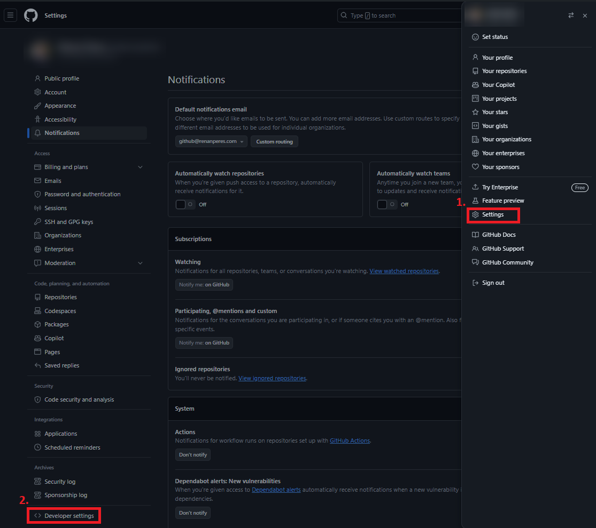
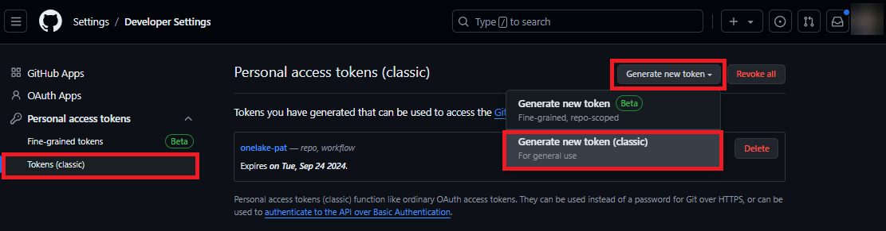

# Fabric Remote Tools

This purpose with this package was to enables remote management of Microsoft Fabric and OneLake resources. It provides CRUD operations for Files and Tables in Fabric Lakehouses, UPSERT operstions for Delta Tables, and some Fabric API executions.

The functions are particularly useful for managing Fabric resources within your external CI/CD and IaC pipelines, offering finer-grained control over your Fabric environment.

## Table of Contents

- [Features](#features)
- [Prerequisites](#prerequisites)
- [Installation](#installation)
- [Get Client Secrets & Tokens](#get-client-secrets--tokens)
  - [Azure Portal Steps](#azure-portal-steps)
  - [Fabric Portal Steps](#fabric-portal-steps)
  - [Azure DevOps Steps](#azure-devops-steps)
  - [GitHub Steps](#github-steps)
- [Functions](#functions)
  - [FabricAuth](#fabricauth)
    - [get_service_principal_token()](#get_service_principal_token)
    - [get_client_secret_token()](#get_client_secret_token)
    - [get_interactive_browser_token()](#get_interactive_browser_token)
    - [get_file_system_client()](#get_file_system_client)
  - [OneLakeUtils](#onelakeutils)
    - [write_to_lakehouse()](#write_to_lakehouse)
    - [list_items()](#list_items)
    - [read_deltalake()](#read_deltalake)
    - [download_from_lakehouse()](#download_from_lakehouse)
    - [delete_file()](#delete_file)
  - [FabricAPIs](#fabricapis)
    - [import_notebook_to_fabric()](#import_notebook_to_fabric)
    - [run_notebook_job()](#run_notebook_job)
    - [trigger_pipeline_job()](#trigger_pipeline_job)
    - [trigger_table_maintenance_job()](#trigger_table_maintenance_job)
    - [trigger_table_maintenance_for_all_tables()](#trigger_table_maintenance_for_all_tables)
- [Troubleshooting](#troubleshooting)
- [References](#references)
- [Contributing](#contributing)
- [Contact](#contact)

## Features

- Authentication using Azure credentials
- CRUD operations for Files and Tables (Delta format) in OneLake 
  - Support for local Files/Tables, GitHub repositories (public and private), and Azure DevOps repositories
  - Delta table support for efficient data storage and retrieval
- Support for Fabric API Management:
  - Import a Notebook to Fabric from Local/GitHub
  - Run a Notebook
  - Trigger a Data Pipeline
  - Trigger Table Maintenance

## Prerequisites

- Python 3.7 or later
- pip (Python package installer)
- Azure account with access to Microsoft Fabric
- Microsoft Fabric workspace and Lakehouse
- Git
- IDE or text editor (e.g., Visual Studio Code, Jupyter Notebook, GitHub Codespaces, Google Colab)
- GitHub account (for private repository access, if applicable)
- Azure DevOps account (for Azure DevOps repository access, if applicable)

## Installation

Install the package directly from GitHub using pip:

```
pip install https://github.com/renan-peres/fabric-remote-tools/raw/main/fabric_remote_tools-0.1.1.tar.gz
```

## Get Client Secrets & Tokens

To interact with Fabric and OneLake storage, follow these steps to obtain the necessary credentials and store them in the `.env` file.

> **Note**: Create a `.env` file from the `.envtemplate` in the repo and add your secrets. Keep your secrets secure and never share them publicly.

```bash
# Azure Portal Secrets
AZURE_CLIENT_ID="<your_azure_client_id>"
AZURE_TENANT_ID="<your_azure_tenant_id>"
AZURE_CLIENT_SECRET="<your_azure_client_secret>"

# Microsoft Fabric Secrets
ACCOUNT_NAME="onelake"
WORKSPACE_ID="<your_fabric_workspace_id>"
LAKEHOUSE_ID="<your_fabric_lakehouse_id>"
WORKSPACE_NAME="<your_fabric_workspace_name>"
LAKEHOUSE_NAME="<your_fabric_lakehouse_name>"

# Azure DevOps Secrets
ADO_PERSONAL_ACCESS_TOKEN="<your_ado_personal_access_token>"
ADO_ORGANIZATIONAL_URL="<your_ado_organization_url>"
ADO_PROJECT_NAME="<your_ado_project_name>"
ADO_REPO_NAME="<your_ado_repo_name>"

# GitHub Secrets
GH_PERSONAL_ACCESS_TOKEN="<your_github_personal_access_token>"
GH_USERNAME="<your_github_username>"
GH_REPO_NAME="<your_github_repo_name>"
```

### Azure Portal Steps

> **Note**: For detailed instructions on creating an app registration in the Azure Portal, refer to the [Fivetran OneLake Setup Guide](https://fivetran.com/docs/destinations/onelake/setup-guide).

1. Register a new application in Azure Portal (Entra ID).
   
   

2. Get Client & Tenant IDs from the application's overview page.
   

3. Create & get Client Secret in the Certificates & secrets section.
   

Update the `.env` file with the obtained values.

### Fabric Portal Steps

1. Get Workspace ID and Lakehouse ID from the Fabric Portal URL.
   

2. Add Application Service Principal to Workspace with at least Contributor access.
   

Update the `.env` file with the obtained values.

### Azure DevOps Steps

1. Create a Personal Access Token (PAT).
   
   
   
   

2. Get Organization URL, Project Name, and Repo Name.
   
   

3. Update the `.env` file with the obtained values.

### GitHub Steps

> **Note**: These steps are required for private repos only. Public repos do not need these credentials.

1. Create a Personal Access Token (PAT) with appropriate permissions.
   
   
   
   

2. Get your Username and Private Repo Name.

3. Update the `.env` file with the obtained values.

## Functions

The project consists of three main classes: `FabricAuth`, `OneLakeUtils`, and `FabricAPIs`. Each class provides various functions for interacting with Microsoft Fabric and OneLake. Below is an overview of each class and its key methods. 

For detailed usage of these functions, please refer to the examples provided in the *[tests](tests/)* folder of this repo.

### FabricAuth

This class handles authentication for Azure services. It is based on the [azure-identity](https://pypi.org/project/azure-identity/) and [azure-storage-file-datalake](https://pypi.org/project/azure-storage-file-datalake/) Python SDKs.

#### get_service_principal_token()
- Returns a `DefaultAzureCredential` object for service principal authentication.

#### get_client_secret_token()
- Authenticates with Azure using client secret credentials.
- Returns a dictionary containing the access token and a flag to use the Fabric endpoint.

##### Parameters
| Name | Type | Default | Description |
|------|------|---------|-------------|
| client_id | str | None | The client ID for authentication |
| client_secret | str | None | The client secret for authentication |
| tenant_id | str | None | The tenant ID for authentication |

#### get_interactive_browser_token()
- Retrieves or generates an interactive browser token for authentication.
- Handles token caching and refreshing.

##### Parameters
| Name | Type | Description |
|------|------|-------------|
| token_file | str | The path to the file where the token will be cached |

#### get_file_system_client()
- Creates and returns a `FileSystemClient` for interacting with Microsoft Fabric's OneLake storage.

##### Parameters
| Name | Type | Description |
|------|------|-------------|
| token_credential | DefaultAzureCredential | The credential object used for authentication |
| account_name | str | The name of the storage account |
| workspace_id | str | The ID of the Fabric workspace |

### OneLakeUtils

This class provides utility functions for working with OneLake storage. Take a look at the examples provided in the *[test_OneLakeUtils.ipynb](tests/01_OneLakeUtils.ipynb)* notebook.

#### write_to_lakehouse()
- Writes data to the lakehouse from various sources (local, git, GitHub, Azure DevOps).

##### Parameters
| Name | Type | Default | Description |
|------|------|---------|-------------|
| file_system_client | FileSystemClient | | The file system client for OneLake storage |
| target_path | str | | The target path in OneLake storage |
| upload_from | str | | The source type (local, git, github, github_private, azure_devops) |
| lakehouse_id | str | | The ID of the lakehouse |
| source_path | str | "" | The source path for local or git uploads |
| github_token | str | None | The GitHub personal access token for private repository access |
| github_username | str | None | The GitHub username for private repository access |
| repo_name | str | None | The repository name for GitHub private or Azure DevOps uploads |
| folder_path | str | None | The specific folder to upload for GitHub or Azure DevOps repositories |
| project_name | str | None | The project name for Azure DevOps uploads |
| organization_url | str | None | The organization URL for Azure DevOps uploads |
| personal_access_token | str | None | The personal access token for Azure DevOps authentication |

#### list_items()
- Lists items in a directory in OneLake storage.

##### Parameters
| Name | Type | Default | Description |
|------|------|---------|-------------|
| file_system_client | FileSystemClient | | The file system client for OneLake storage |
| target_directory_path | str | | The target directory path in OneLake storage |
| lakehouse_id | str | | The ID of the lakehouse |
| print_output | bool | False | Whether to print the output |

#### read_deltalake()
- Reads a delta table from OneLake storage using the specified engine and version.

##### Parameters
| Name | Type | Default | Description |
|------|------|---------|-------------|
| file_system_client | FileSystemClient | | The file system client for OneLake storage |
| table_path | str | | The path to the delta table within the Lakehouse |
| engine | str | | The engine to use for reading the delta table |
| version | int | None | The specific version of the delta table to read |
| row_limit | int | None | The maximum number of rows to retrieve |

#### download_from_lakehouse()
- Downloads a file or folder from OneLake storage to the current directory.

##### Parameters
| Name | Type | Description |
|------|------|-------------|
| file_system_client | FileSystemClient | The file system client for OneLake storage |
| target_file_path | str | The target file or folder path in OneLake storage |
| lakehouse_id | str | The ID of the lakehouse |

#### delete_file()
- Deletes a file, table, or folder from OneLake storage.

##### Parameters
| Name | Type | Description |
|------|------|-------------|
| file_system_client | FileSystemClient | The file system client for OneLake storage |
| lakehouse_dir_path | str | The path of the file, table, or folder to delete |
| lakehouse_id | str | The ID of the lakehouse |

### FabricAPIs

This class handles various operations with Microsoft Fabric APIs.

#### import_notebook_to_fabric()
- Imports a notebook into Microsoft Fabric from various sources.

##### Parameters
| Name | Type | Default | Description |
|------|------|---------|-------------|
| token | str | | Authentication token for API access |
| upload_from | str | | Source of the notebook (local, lakehouse, or github) |
| source_path | str | | Path or URL of the notebook to import |
| default_lakehouse_id | str | None | ID of the default lakehouse |
| default_lakehouse_workspace_id | str | None | ID of the default lakehouse workspace |
| environment_id | str | None | ID of the environment |
| environment_workspace_id | str | None | ID of the environment workspace |
| known_lakehouses | list | None | List of known lakehouse IDs |
| max_workers | int | 5 | Maximum number of worker threads for concurrent imports |

#### run_notebook_job()
- Runs a Spark notebook job.

##### Parameters
| Name | Type | Default | Description |
|------|------|---------|-------------|
| token | str | | The authentication token |
| notebook_id | str | | The ID of the notebook to run |
| workspace_id | str | None | The ID of the workspace |
| lakehouse_id | str | None | The ID of the lakehouse |
| lakehouse_name | str | None | The name of the lakehouse |

#### trigger_pipeline_job()
- Triggers a data pipeline job.

##### Parameters
| Name | Type | Default | Description |
|------|------|---------|-------------|
| token | str | | The authentication token |
| pipeline_id | str | | The ID of the pipeline to trigger |
| workspace_id | str | None | The ID of the workspace |

#### trigger_table_maintenance_job()
- Triggers a Delta table maintenance job.

##### Parameters
| Name | Type | Description |
|------|------|-------------|
| table_name | str | The name of the table to maintain |
| token | str | The authentication token |

#### trigger_table_maintenance_for_all_tables()
- Triggers maintenance jobs for all tables in the lakehouse.

##### Parameters
| Name | Type | Default | Description |
|------|------|---------|-------------|
| token | str | | The authentication token |
| file_system_client | FileSystemClient | | The file system client for OneLake storage |
| batch_size | int | 5 | Number of tables to process in each batch |
| batch_delay | int | 60 | Delay between batches in seconds |

## Troubleshooting

If you encounter issues:

1. Ensure all environment variables in your `.env` file are correctly set.
2. Check that you have the necessary permissions in your Azure and Fabric accounts.
3. Verify that your Python version is 3.7 or higher.
4. If you get authentication errors, try refreshing your Azure credentials.
5. For GitHub private repository issues, ensure your Personal Access Token has the necessary permissions.

For more specific issues, check the error messages in the console output or refer to the [Azure Storage documentation](https://docs.microsoft.com/en-us/azure/storage/).

## References

This project compiles documentation from the following sources:
- [Microsoft Documentation: Use Python to manage files and folders in Microsoft OneLake](https://learn.microsoft.com/en-us/fabric/onelake/onelake-access-python)
- [GitHub: Azure-Samples/modern-data-warehouse-dataops/single_tech_samples/fabric/fabric_ci_cd](https://github.com/Azure-Samples/modern-data-warehouse-dataops/tree/main/single_tech_samples/fabric/fabric_ci_cd)
- [GitHub: microsoft/semantic-link-labs](https://github.com/microsoft/semantic-link-labs/)
- [GitHub: djouallah/Light_ETL_Challenge](https://github.com/djouallah/Light_ETL_Challenge)
- [Fivetran: OneLake Setup Guide](https://fivetran.com/docs/destinations/onelake/setup-guide)

## Contributing

Contributions are welcome! To contribute:

1. Fork the repository
2. Create a new branch (`git checkout -b feature/your-feature`)
3. Make your changes
4. Commit your changes (`git commit -am 'Add new feature'`)
5. Push to the branch (`git push origin feature/your-feature`)
6. Create a new Pull Request

Please ensure your code adheres to the project's coding standards and includes appropriate tests.

## Contact

For questions or support, please open an issue in the GitHub repository or contact me at contact@renanperes.com.
